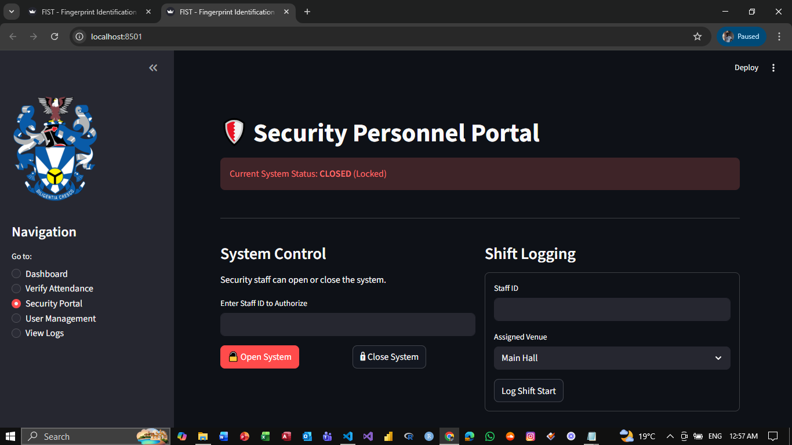

### FIST - Fingerprint Identification Student Terminal
##### University of Zululand | Capstone Project | June 2024 – November 2024


📝 ***Project Disclaimer***

This repository contains a DEMO/PROTOTYPE version of the original Capstone Project.

The main project was developed and validated with a large dataset during the research phase. This specific repository serves as a public access demonstration of the system architecture and software logic. It is not the original hosted system but a functional replica created for portfolio and record-keeping purposes.

🚀 ***Key Features***
- Biometric Verification: Fingerprint identification using SVM (Support Vector Machine) algorithms.
- System State Control: Security personnel can lock/unlock the verification terminal.
- Attendance Logging: Automated recording of student entry (Time, Venue, Reason).
- Security Shift Management: Logging of security personnel shifts and duties.
- Modern UI: Clean interface featuring University of Zululand branding.

📊 ***Research Performance Metrics***

The underlying biometric engine was rigorously tested during the research phase with a substantial dataset, achieving the following performance metrics:

- Precision	93.82%
- Accuracy	89.00%
- Recall	83.50%

Note: The model file included in this demo is trained on a reduced sample set for demonstration purposes only.

🛠️ ***Tech Stack***
- Language: Python 3.9+
- Machine Learning: scikit-learn (SVM), opencv-python (Image Processing)
- Frontend: streamlit
- Data Storage: JSON (File-based database)

⚙️ ***Installation & Setup***

Clone the repository:
```
git clone https://github.com/Siyamthanda-code/FIST.gitcd FIST
```
Install dependencies:
```bash
pip install -r requirements.txt
```
Reset the Database (First time only):
Initializes the default security admin account.
```bash
python reset_system.py
```
Train the Model:
Ensure images are in the dataset/ folder.
```bash
python model_trainer.py
```
Run the Application:
```bash
streamlit run app.py
```

📁 ***Project Structure***
```text

FIST-Terminal/
├── app.py                # Main Streamlit Interface
├── model_trainer.py      # ML Training Pipeline
├── db_manager.py         # Database Logic
├── reset_system.py       # DB Initialization
├── requirements.txt      # Dependencies
├── db.json               # Database File
├── svm_fingerprint_model.pkl # Trained Model
├── dataset/              # Fingerprint Images
├── assets/               # Logos and Icons
└── docs/                 # SRS and SDD Documentation
```
🔐 ***Default Access***

The prototype includes a default Security Admin for testing:

```text
Staff ID: SEC001
```

Upload to GitHub

Now that the file exists, run these commands in your terminal:

```bash
git add README.md
```
```
git commit -m "Add project README"
```
```
git push
```


